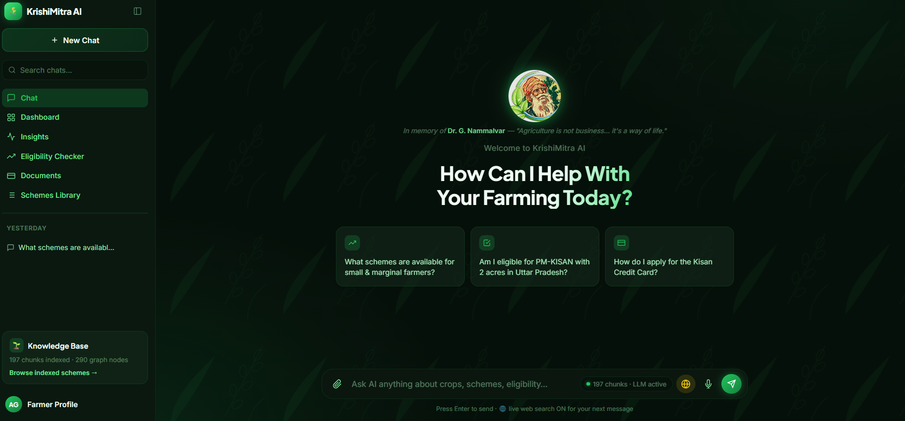

# 🌾 KrishiMitra AI

**Find the right farmer scheme. Understand why. Trust the evidence.**

> Know your schemes. Verify your eligibility. Take the next step.

KrishiMitra AI is an **evidence-first AI assistant for Indian government
farmer schemes**, built primarily on trusted content from
[Vikaspedia](https://vikaspedia.in/). It is deliberately **not** a generic
chatbot — every answer follows the chain:

**ANSWER → EVIDENCE → ELIGIBILITY → MISSING INFORMATION → NEXT STEP**

---

## 🚀 How to access the site

```bash
python -m venv .venv && source .venv/bin/activate   # Windows: .venv\Scripts\activate
pip install -r requirements.txt
python scripts/demo_seed.py          # only if data/vector_store is empty
uvicorn app.api.main:app --port 8000
```
Open **http://localhost:8000** — it redirects straight to the chat UI
(`/ui/chatbot-ui-green.html`). That's the primary, fully-functional surface.



Optional classic UI alongside it: `streamlit run app/ui/streamlit_app.py` →
`http://localhost:8501` (its sidebar links back to the same chat UI).

No `OPENAI_API_KEY`? It still works — see [Installation](#installation) for
the deterministic fallback. Full setup detail, env vars, and troubleshooting
are further down; this is just the fastest path to a running app.

---

## Table of contents

1. [Problem statement](#problem-statement)
2. [Why existing chatbots fail here](#why-existing-chatbots-fail-here)
3. [Solution & differentiators](#solution--differentiators)
4. [Architecture](#architecture)
5. [Technology stack](#technology-stack)
6. [RAG pipeline](#rag-pipeline)
7. [Knowledge graph](#knowledge-graph)
8. [Guardrails](#guardrails)
9. [Live web search (opt-in)](#live-web-search-opt-in)
10. [Eligibility engine](#eligibility-engine)
11. [Evaluation](#evaluation)
12. [Data ingestion](#data-ingestion)
13. [Supported inputs](#supported-inputs)
14. [Web UI (green theme)](#web-ui-green-theme)
15. [Conversation history](#conversation-history)
16. [Mobile app (PWA)](#mobile-app-pwa)
17. [Installation](#installation)
18. [Environment variables](#environment-variables)
19. [Running the crawler](#running-the-crawler)
20. [Building the index & graph](#building-the-index--graph)
21. [Running Streamlit](#running-streamlit)
22. [Running the API](#running-the-api)
23. [Running tests](#running-tests)
24. [Running evaluation](#running-evaluation)
25. [Demo walkthrough](#demo-walkthrough)
26. [Known limitations](#known-limitations)
27. [Future roadmap](#future-roadmap)

---

## Problem statement

Millions of Indian farmers are potentially eligible for government schemes
(PM-KISAN, PMFBY, Soil Health Card, KCC, PMKSY, PM-KUSUM, and dozens more)
but don't know which schemes apply to them, what the real eligibility
criteria are, or how to tell a genuine benefit from hearsay/misinformation
("my neighbor said only large farmers get this").

## Why existing chatbots fail here

Generic LLM chatbots will confidently:
- invent scheme names, benefit amounts, deadlines, and contact numbers,
- blur "this topic is relevant to you" with "you are eligible",
- answer from stale/general training data instead of current scheme rules,
- give no way to check *where* a claim came from.

For a farmer deciding whether to spend time/money applying for a scheme,
that confidence without evidence is actively harmful.

## Solution & differentiators

1. **Evidence-first AI** — every claim traces to a cited chunk of ingested text.
2. **Hybrid RAG** — dense vector search + BM25 lexical search + knowledge-graph
   traversal, fused via Reciprocal Rank Fusion.
3. **Corrective RAG (CRAG)** — a retrieval evaluator grades evidence quality
   and refines/rewrites before generation, never guesses.
4. **Knowledge graph** — schemes, benefits, eligibility, crops, states,
   departments as an explicit, queryable graph (NetworkX).
5. **Deterministic eligibility engine** — never an LLM guess; four honest
   verdicts (`likely_eligible` / `possibly_eligible` /
   `insufficient_information` / `likely_not_eligible`).
6. **Objection handling** — "my neighbor said X" is detected and answered
   from evidence only, without arguing or inventing a rebuttal.
7. **Multimodal ingestion** — PDF, image (OCR), Excel/CSV, voice.
8. **Offline knowledge base by default** — the cited, evidence-first answer
   never depends on a live web request, regardless of the toggle below. An
   *optional* per-message live web search exists as a clearly separate,
   unverified channel (see [Live web search](#live-web-search-opt-in)),
   toggleable per message (on by default in the shipped UI) — its results
   are never blended into the cited answer or run through the
   hallucination guard, no matter which way the toggle is set.
9. **No hallucinated "breaking news"** — explicitly refuses "what's new
   today" questions; states the knowledge base's last-indexed date.
10. **Source-level citations** — "View source" links back to the real
    Vikaspedia page/section, or clearly labels a user-uploaded document.
11. **Confidence scoring** — every answer carries high/medium/low confidence
    tied to actual retrieval strength.
12. **Guardrails** — prompt-injection defense, off-topic refusal,
    hallucination guard, all deterministic and dependency-free by default,
    with optional NeMo Guardrails as a second opinion.
13. **Evaluation metrics** — a 33-case golden dataset across 10 categories,
    with an optional DeepEval LLM-as-judge layer.

## Architecture

See [`docs/architecture.md`](docs/architecture.md) for the full write-up and
a Mermaid flow diagram. In short:

```
User → Input Guardrail → Profile Extractor → Hybrid Retrieval
     (vector + BM25 + graph → RRF fusion → Corrective RAG)
     → Retrieval Guardrail (evidence threshold)
     → Answer Generation (LLM if configured, else deterministic extractive fallback)
     → Hallucination Guard (per-claim citation + lexical verification)
     → Eligibility Engine (deterministic, overrides any LLM guess)
     → Trust Panel + Scheme Cards + Evidence → Streamlit UI / FastAPI
```

## Technology stack

| Layer | Choice |
|---|---|
| UI | Streamlit (premium green "agriculture + AI + trust" theme, not a ChatGPT clone) |
| API | FastAPI |
| LLM | OpenAI API (`OPENAI_CHAT_MODEL`, default `gpt-4o-mini`) — with a genuine deterministic fallback when no key is configured |
| Embeddings | Hugging Face `sentence-transformers`, default `paraphrase-multilingual-mpnet-base-v2` (multilingual, Indian-language-capable), configurable via env |
| Vector store | Chroma (persistent local mode), behind a `VectorStoreInterface` so a Qdrant backend can be added without touching retrieval code |
| Lexical search | `rank-bm25`, fused with vector search via Reciprocal Rank Fusion |
| Knowledge graph | NetworkX (`MultiDiGraph`), persisted as a pickle |
| Crawling | Playwright (Vikaspedia is client-rendered; a plain HTTP GET returns an empty shell) |
| Live web search *(opt-in)* | `requests` + `beautifulsoup4` against DuckDuckGo's HTML endpoint, no API key — off by default, never blended into the cited answer (see [Live web search](#live-web-search-opt-in)) |
| Document processing | PyMuPDF/pypdf (PDF), Pillow + pytesseract (image OCR, pluggable), pandas/openpyxl (Excel/CSV), OpenAI audio API (voice, pluggable) |
| Guardrails | Deterministic regex/keyword logic (primary) + optional NeMo Guardrails self-check (secondary, opt-in) |
| Evaluation | Custom deterministic harness (primary) + optional DeepEval LLM-as-judge (secondary, opt-in) |
| Config | Pydantic Settings + `.env` |
| Conversation history | SQLite (stdlib `sqlite3`, no ORM) — `app/conversations/`, one row per conversation/message, survives restarts |
| Web UI | Static HTML/CSS/JS (`web/`), served by FastAPI at `/ui`, calling the same `/chat`-backed `/conversations` API — no build step, no framework |
| Testing | pytest (81+ tests) |
| Optional high-perf service | Go (stdlib-only ingestion job queue — see `go-service/`) |

## RAG pipeline

1. **Query classification** — cheap keyword check for domain relevance.
2. **Entity extraction** — crop / state / farmer-type / landholding, from
   both the query text and an optional Farmer Profile.
3. **Vector search** — Chroma + sentence-transformers.
4. **BM25 search** — exact keyword/acronym matching.
5. **Graph search** — crop/state/farmer-type → Scheme traversal.
6. **Fusion** — Reciprocal Rank Fusion + graph-confirmation boost.
7. **Corrective RAG** — evaluate (correct/ambiguous/incorrect) → refine
   weak evidence or rewrite the query with concrete extracted signals.
8. **Evidence threshold gate** — refuse rather than guess if nothing strong
   enough was found.
9. **Generation** — structured JSON contract (LLM) or deterministic
   extractive fallback (no key configured) — same schema either way.
10. **Hallucination guard** — every claim re-verified against actual
    evidence text; unsupported claims are deleted, not just flagged.
11. **Eligibility engine** — deterministic verdict, always overrides
    whatever the LLM said.

## Knowledge graph

Node types: `Scheme, Benefit, Eligibility, FarmerType, Crop, State,
District, Ministry, Department, Document, Source, Requirement,
ApplicationMethod, Contact, Category`.

Edges: `HAS_BENEFIT, HAS_ELIGIBILITY, FOR_CROP, AVAILABLE_IN, MANAGED_BY,
HAS_REQUIREMENT, SOURCE, MENTIONED_IN, HAS_APPLICATION_METHOD, HAS_CONTACT,
IN_CATEGORY, FOR_FARMER_TYPE`.

Built by rule-based extraction (`app/graph/graph_builder.py`) — no LLM in
the loop, so the graph never contains anything not literally present in the
ingested text. Every edge carries the `document_id` it came from.

## Guardrails

- **Input**: prompt-injection detection (regex, always-on) +
  off-topic/relevance check + optional NeMo Guardrails self-check-input rail
  (`NEMO_GUARDRAILS_ENABLED=true`, requires `OPENAI_API_KEY`; fails open on
  any error — it is defense-in-depth, never a single point of failure).
- **Retrieval**: evidence-confidence threshold — refuse rather than answer
  from weak evidence.
- **Answer**: per-claim citation + lexical-overlap verification; a scheme
  card is never shown with zero verifiable citations.
- **Prompt-injection framing**: retrieved documents are explicitly instructed
  to be treated as **data, not instructions**, in the system prompt.

## Live web search (opt-in)

Two independent switches, both must allow it:

- **Operator switch** — `WEB_SEARCH_ENABLED` in `.env` (off by default in
  `.env.example`; this repo's own `.env` has it turned on). A deployment
  that wants the feature unavailable to anyone sets this to `false` and
  nothing below matters.
- **Per-message toggle** — the 🌐 globe icon in the green UI's composer.
  It now defaults to **on** in the shipped UI (a click turns it off for
  subsequent messages), but the request body still carries an explicit
  `web_search: true/false` either way — the backend never assumes it.

When both agree, `app/websearch/search.py` runs a live DuckDuckGo HTML
search (no API key needed) and attaches raw results (`title`, `url`,
`snippet`) to `ChatResponse.web_results`, with `web_search_used: true`.

This is deliberately **not** integrated into the RAG pipeline:

- Never fed into the LLM prompt, never subject to the hallucination guard
  or citation verification — there's no vetted source to verify a live
  result *against*.
- Rendered as its own dashed, distinctly-labeled "⚠️ unverified" box in the
  UI, physically separate from the cited `answer` and its `evidence` list.
- Any failure (network, parsing, rate-limiting) returns an empty list —
  a broken web search never breaks the underlying cited answer.

This exists for users who want a live pointer to an official portal or a
same-day detail (see [Solution & differentiators](#solution--differentiators)
#8) without weakening the core guarantee for everyone else: the answer you
get by default, with the toggle off, is exactly as offline and cited as
before this feature existed.

## Eligibility engine

`app/eligibility/`:
- `extractor.py` — pulls state/crop/landholding/farmer-type from free text.
- `rules.py` — parses eligibility-criteria *text* (already retrieved as
  evidence) into checkable rules (land ceilings, farmer-type phrases, named
  states/crops) — nothing is invented, everything is parsed from real text.
- `matcher.py` — compares a `FarmerProfile` against parsed criteria,
  producing one of four states; a scheme is never called "likely eligible"
  unless a real criterion was matched.
- `explanation.py` — renders a cautious, human-readable explanation.

## Evaluation

See [`docs/evaluation.md`](docs/evaluation.md). Run:

```bash
python scripts/evaluate.py
python scripts/evaluate.py --deepeval   # optional LLM-as-judge layer
```

## Data ingestion

Vikaspedia is crawled **offline, explicitly** via Playwright
(`scripts/crawl_vikaspedia.py`) — never during a chat session. The
repository ships with `data/raw/vikaspedia_documents.json`, the output of a
real crawl run against live Vikaspedia during development (seed URLs
discovered via `https://en.vikaspedia.in/sitemap.xml`), covering PM-KISAN,
PMFBY, Soil Health Card, Kisan Credit Card, PMKSY (ground water irrigation),
Interest Subvention, Crop/Agricultural Insurance, and PM-KUSUM.
`scripts/demo_seed.py` ingests that file for `DEMO_MODE=true`, or falls back
to a small set of hand-embedded excerpts (also copied verbatim from real
Vikaspedia pages, never invented) if the crawl output is missing.

## Supported inputs

Text, PDF, image (OCR, pluggable), Excel/CSV, voice (speech-to-text via
OpenAI's audio API, pluggable). Every upload is validated (extension
allowlist, size cap, best-effort MIME check), processed through the same
chunk → embed → index → optional graph-extraction pipeline as crawled
content, and labeled **User-provided document** — never silently merged
with Vikaspedia content.

## Web UI (green theme)

Alongside Streamlit, `web/` holds a self-contained, green-themed HTML/CSS/JS
front end — 7 screens (Chat, Dashboard, Insights, Eligibility Checker,
Documents, Schemes Library, Profile) styled as a modern chat app rather than
a generic Streamlit dashboard. FastAPI serves it directly:

```bash
uvicorn app.api.main:app --port 8000
# → http://localhost:8000/ui/chatbot-ui-green.html   (or just http://localhost:8000/, which redirects there)
```

The Chat screen is fully wired to the live API — no mock data: it creates
real conversations, calls `/conversations/{id}/messages` (same
`generate_answer` pipeline as Streamlit), and renders confidence badges,
eligibility verdicts, expandable evidence citations, and follow-up chips
straight from the actual `ChatResponse`. Its composer also has a 🌐 toggle
for the opt-in [live web search](#live-web-search-opt-in) — on by default
in this UI, results shown in their own dashed "unverified" box, never mixed
into the cited answer above it. The other 6 screens are static mockups
sharing the same visual language, not yet wired to real endpoints.
Streamlit's sidebar has an **"🟢 Open modern Green UI"** button linking here —
it's a real link, not an embed, since browsers commonly block a same-page
iframe pointing at a different localhost port.

## Conversation history

Chats are persisted server-side in SQLite (`data/conversations.db`, via
`app/conversations/store.py` — plain `sqlite3`, no ORM, consistent with
every other on-disk artifact in this repo). The green UI's sidebar lists
real saved conversations grouped by **Pinned / Today / Yesterday / Previous
7 Days / Older**, computed from actual timestamps; conversations can be
renamed (double-click a title), pinned, or deleted, and survive a server
restart. `GET/POST /conversations`, `GET/PATCH/DELETE /conversations/{id}`,
and `POST /conversations/{id}/messages` are the full surface — see
`app/api/routes/conversations.py`.

Note: history is one shared SQLite file with no user accounts yet, so every
visitor to a given server currently sees the same conversation list — fine
for a solo/demo deployment, not yet multi-tenant.

## Mobile app (PWA)

The green UI is installable as a Progressive Web App — no separate native
codebase, no app store, same FastAPI backend. On a phone, open
`http://<your-machine-ip>:8000` in Chrome/Safari and use
**"Add to Home Screen"**: it installs with its own icon and launches
full-screen (no browser address bar), backed by:

- `web/manifest.json` — name, icons, `display: standalone`, theme colors
- `web/sw.js` — a minimal service worker that caches the static app shell
  (HTML/CSS/JS/icons) for offline resilience opening the app, while every
  API call (`/chat`, `/conversations/...`) is always network-first, never
  cached — a farming-scheme answer must never be served stale
- Icons generated with Pillow (already a project dependency) —
  `web/icons/icon-192.png`, `icon-512.png`, `apple-touch-icon.png`

This is a deliberate choice over a separate React Native/Flutter app: zero
new toolchain, zero risk to the existing FastAPI/Streamlit project (every
file here is new, nothing existing was modified to add it), and it reuses
100% of the already-built, already-wired chat UI.

## Installation

Requires Python 3.11+ (developed/tested on 3.14).

```bash
python -m venv .venv
# Windows:
.venv\Scripts\activate
# macOS/Linux:
source .venv/bin/activate

pip install -r requirements.txt
python -m playwright install chromium   # only needed to run the crawler

cp .env.example .env
# edit .env — at minimum decide OPENAI_API_KEY (optional — see below)
```

**No OpenAI key?** The app still works. `app/llm/answer_generator.py` uses a
deterministic extractive fallback (real retrieved text + the deterministic
eligibility engine) instead of an LLM — never a fake/hardcoded response.

## Environment variables

See [`.env.example`](.env.example) for the full, commented list. Key ones:

| Variable | Purpose |
|---|---|
| `OPENAI_API_KEY` | Enables LLM-based generation, voice transcription. Optional. |
| `EMBEDDING_MODEL` | Sentence-transformers model (default: multilingual mpnet). |
| `VECTOR_STORE_PROVIDER` / `VECTOR_STORE_PATH` | Chroma persistent store location. |
| `RETRIEVAL_SCORE_THRESHOLD` | Evidence-confidence gate (default `0.32`). |
| `DEMO_MODE` | Seeds/labels a demo knowledge base. |
| `DEBUG_MODE` | Shows the internal retrieval/guardrail debug panel. |
| `NEMO_GUARDRAILS_ENABLED` | Optional supplementary LLM-based input rail. |
| `DEEPEVAL_ENABLED` | Optional LLM-as-judge evaluation layer. |
| `API_PORT` | Port FastAPI/uvicorn binds (default `8000`). Both the green web UI's URL and Streamlit's sidebar link to it are built from this — keep them in sync if you change it. |
| `CONVERSATIONS_DB_PATH` | SQLite file for persisted chat history (default `data/conversations.db`). |
| `WEB_SEARCH_ENABLED` | Master switch for opt-in live web search (default `false`). See [Live web search](#live-web-search-opt-in). |
| `WEB_SEARCH_MAX_RESULTS` / `WEB_SEARCH_TIMEOUT_SECONDS` | Result cap and request timeout for that live search. |

## Running the crawler

```bash
python scripts/crawl_vikaspedia.py --max-pages 20
```

Reads `config/crawl.yaml` (seed URLs, domain allowlist, include/exclude
patterns, rate limits). Respects `robots.txt`. Saves section-level documents
to `data/raw/vikaspedia_documents.json` with full provenance
(`source_url`, `section`, `crawl_timestamp`, content hash).

## Building the index & graph

```bash
python scripts/build_index.py --input data/raw/vikaspedia_documents.json
python scripts/build_graph.py --input data/raw/vikaspedia_documents.json   # if you only want to refresh the graph
```

Or, for a guaranteed-working demo without re-crawling:

```bash
python scripts/demo_seed.py
```

## Running Streamlit

```bash
streamlit run app/ui/streamlit_app.py
```

Its sidebar includes a direct link to the green-themed web UI (see
[Web UI (green theme)](#web-ui-green-theme)) — that link needs the FastAPI
server running too (below), on the same `API_PORT`.

## Running the API

```bash
uvicorn app.api.main:app --reload --port 8000
```

Endpoints: `GET /health`, `POST /chat`, `POST /upload`, `POST /ingest`,
`POST /evaluate`, `GET /stats`, `GET /schemes`, `POST /scheme/compare`,
plus the conversation-history surface (`GET/POST /conversations`,
`GET/PATCH/DELETE /conversations/{id}`, `POST /conversations/{id}/messages`
— see [Conversation history](#conversation-history)). Also serves the
static web UI at `/ui` (redirected to from `/`).

## Running tests

```bash
pytest
```

81+ tests across guardrails, retrieval (chunking/reranking/RRF), knowledge
graph, eligibility engine, citations, ingestion (PDF/Excel/security),
conversation history, live web search (network calls mocked — this suite
stays fully offline), and full end-to-end answer generation.

## Running evaluation

```bash
python scripts/evaluate.py
```

## Demo walkthrough

See [`docs/demo-script.md`](docs/demo-script.md) for the full 3-minute flow,
and [`docs/dataset-coverage.md`](docs/dataset-coverage.md) for exactly which
schemes are safe to name live vs. which will (correctly) refuse.

## Known limitations

- **Embedding-threshold calibration on tiny corpora**: sentence-embedding
  cosine similarity has a "high floor" between same-domain sentences; the
  system's real hallucination guarantee is structural (citation + lexical
  verification), not threshold-based — see `docs/evaluation.md`.
- **Graph entity extraction is rule-based**, tuned to Vikaspedia's own
  section headings and a curated crop/state/farmer-type vocabulary; a
  scheme whose page doesn't use those headings may get weaker graph
  connectivity (it still remains reachable via vector/BM25 search).
- **Multilingual coverage** depends on what's actually indexed — the
  shipped crawl is English-language Vikaspedia content; Hindi/Tamil/other
  language subdomains are architecturally supported (language is tracked
  per-chunk) but not pre-crawled in this build.
- **NeMo Guardrails / DeepEval integrations** are wired and functional but
  **disabled by default** and not exercised in this session's automated
  test run (both require `OPENAI_API_KEY`, which wasn't configured here) —
  verify them with a real key before depending on them in production.
- **Go ingestion service** compiles against the stdlib only but was not
  built/run in this environment (no Go toolchain available here) — verify
  with `go build` before relying on it.
- **Docker image** was authored but not built/tested in this session.

## Future roadmap

- Qdrant backend behind the existing `VectorStoreInterface`.
- Pre-crawl and index Hindi/Tamil Vikaspedia subdomains.
- Cross-encoder reranking as an optional upgrade to the current lexical +
  RRF reranker for larger corpora.
- Persistent per-user farmer profiles (currently session-only, by design).
- Formal PII scrubbing for uploaded documents.

---

## Project history note

Earlier prototype snippets exploring a simpler "KisanBot" chatbot concept
(a single OpenAI-call topic classifier, FAISS+LangChain retrieval, no
citations/eligibility engine/knowledge graph) exist under `Claude outputs/`
in this repository from an earlier exploration pass. They were preserved
rather than deleted, but KrishiMitra AI's architecture described above
supersedes that approach entirely — it does not build on top of it.
