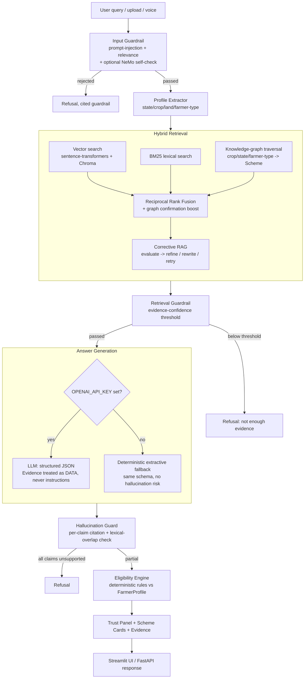

# KrishiMitra AI — Architecture

## 1. Design principle

> **NO EVIDENCE = NO CLAIM.**

Every factual sentence the system shows a farmer must be traceable to a
specific chunk of ingested, approved text. The architecture exists to make
that traceability structural, not a prompt-engineering hope:

- Retrieval always returns typed `EvidenceChunk` objects carrying
  `document_id`, `source_url`, `section`, `source_type`.
- The LLM (when used) is contractually required to cite `chunk_id`s for
  every claim (`app/llm/schemas.py::LLMAnswer`).
- A deterministic verifier (`app/guardrails/hallucination.py`) re-checks
  every claim against the actual evidence text and **deletes** anything
  unsupported before it reaches the user — regardless of what the LLM said.
- Eligibility is **never** decided by asking the LLM "is this farmer
  eligible?" — a separate, deterministic rules engine
  (`app/eligibility/`) parses eligibility criteria text and a
  `FarmerProfile`, and produces one of four defensible states
  (`likely_eligible` / `possibly_eligible` / `insufficient_information` /
  `likely_not_eligible`).

## 2. High-level flow

## 3. Module map

| Concern | Package |
|---|---|
| Config, logging, security, exceptions | `app/core/` |
| Chunking, embeddings, vector store, BM25, hybrid retrieval, CRAG, reranking, citations | `app/rag/` |
| Knowledge graph build + query | `app/graph/` |
| Crawling (Playwright) + PDF/image/Excel/audio ingestion | `app/ingestion/` |
| LLM client, prompts, structured schemas, orchestrator | `app/llm/` |
| Guardrails (input/retrieval/answer/injection/relevance/hallucination + optional NeMo) | `app/guardrails/` |
| Deterministic eligibility engine | `app/eligibility/` |
| Objection/misconception detection & handling | `app/objection/` |
| Evaluation harness (+ optional DeepEval) | `app/evaluation/` |
| FastAPI routes | `app/api/` |
| Streamlit UI | `app/ui/` |

## 4. Why hybrid retrieval (vector + BM25 + graph)?

- **Vector search** (multilingual sentence-transformers over Chroma) finds
  semantically related passages even when wording differs.
- **BM25** catches exact keyword/acronym matches ("PM-KISAN", "PMFBY", "₹6,000")
  that embeddings can under-weight.
- **Knowledge graph traversal** answers *relationship* questions directly —
  "I grow rice in Tamil Nadu" walks `Crop --FOR_CROP--> Scheme
  --AVAILABLE_IN--> State` edges to find schemes vector/BM25 search alone
  might rank lower.
- Results are fused via **Reciprocal Rank Fusion** (order-based, so two
  incomparable scoring scales combine fairly) with a small graph-confirmation
  boost, then reranked.

## 5. Corrective RAG (CRAG)

A retrieval-evaluator step grades the fused evidence:

- **Correct** → used as-is.
- **Ambiguous** → *knowledge refinement*: chunks far weaker than the best
  match are dropped so noise doesn't dilute the LLM's context.
- **Incorrect** → the query is rewritten using *concrete* extracted signals
  (a graph-matched scheme name, a named crop/state) and retried once.
  Generic filler words are deliberately never added to a rewrite — that
  would inflate similarity against any agriculture chunk and defeat the
  evidence gate. If nothing concrete was extracted, no rewrite happens.
- There is **no live web-search fallback** (unlike the original CRAG
  paper) — spec-mandated: chat never scrapes the web in real time. A
  still-insufficient rewrite falls through to the retrieval guardrail's
  refusal.

## 6. Knowledge graph

Entity types: `Scheme, Benefit, Eligibility, FarmerType, Crop, State,
District, Ministry, Department, Document, Source, Requirement,
ApplicationMethod, Contact, Category`. Relations:
`HAS_BENEFIT, HAS_ELIGIBILITY, FOR_CROP, AVAILABLE_IN, MANAGED_BY,
HAS_REQUIREMENT, SOURCE, MENTIONED_IN, HAS_APPLICATION_METHOD, HAS_CONTACT,
IN_CATEGORY, FOR_FARMER_TYPE`.

Extraction is **rule-based, not LLM-based** (`app/graph/graph_builder.py`):
regex/keyword matching against known crops, Indian states, farmer-type
phrases, scheme-name patterns, and Vikaspedia's own section headings
("What are the benefits?", "Eligibility", "How to apply?"). Every edge
carries the `document_id` it was extracted from, so graph-based retrieval
hands back citable evidence, never an unattributed "fact".

## 7. Source policy & provenance

Every `Chunk`/`EvidenceChunk` carries `source_type` (`vikaspedia` /
`trusted_document` / `user_upload`), `source_url`, `section`, `language`,
and `crawl_timestamp` end-to-end from ingestion through to the UI's
"View source" link. Sources are never merged without a visible label.

## 8. Performance

Embedding model, vector store, and knowledge graph are process-wide
singletons (`get_embedder()`, `get_vector_store()`, `get_knowledge_graph()`),
loaded once and reused — not reconstructed per request. Streamlit additionally
wraps this in `st.cache_resource`.
